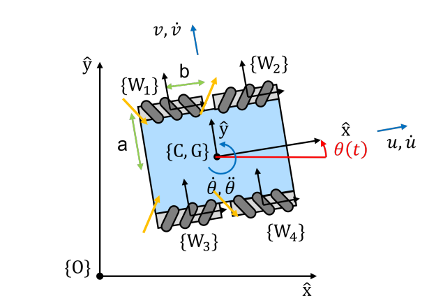

# wheeled-robot-simulation

This repository contains Python code for simulating the motion of a robot equipped with four Swedish wheels. The purpose of this repository is to accurately model the robot's kinematics and dynamics and to analyze specific scenarios related to its motion.

## Robot Description



- **Wheel Type**: Swedish wheels with rollers oriented at ±45 degrees.
- **Parameters**:
  - Wheel radius: \( r = 0.01 \) m
  - Positions:
    - Along the y-axis: \( a = 0.5 \) m
    - Along the x-axis: \( b = 0.2 \) m
  - Mass: \( m = 6.0 \) kg
  - Moment of inertia: \( I = 0.25 \) kg·m²

## Scenarios Analyzed

1. **Trajectory with Equal Forces**:
   - **Description**: With equal forces of 1 N applied by all four wheels, the robot moves in a straight line.

2. **Effect of Wheel Wear**:
   - **Description**: A 0.01% reduction in force on one wheel causes the robot to deviate gradually, resulting in a slight curved trajectory.

3. **Circular Motion**:
   - **Description**: By calculating appropriate wheel velocities using the wheel matrix, the robot can be made to move in a circle.


## Files

- `wheeledRobot.py`: Functions for kinematics and dynamics simulation.
- `main.py`: Demonstrates the usage of these functions.
- `wheeled_robots_figure.png`: Image of the robot configuration.
- `README.md`: Project description.

## How to Run

1. **Install Dependencies**:

   ```bash
   pip install numpy matplotlib roboticstoolbox-python
   ```

2. **Execute the Simulation**:

   ```bash
   python main.py
   ```


